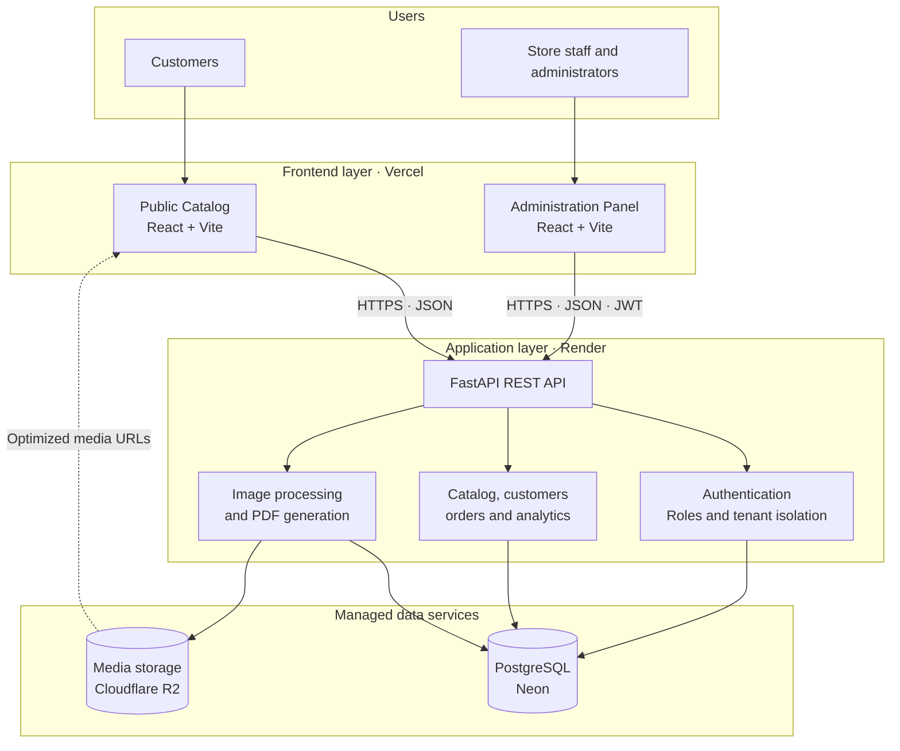

# Catalogo VR

> A multi-tenant digital catalog and order management platform for small businesses that sell through social channels and WhatsApp.


Catalogo VR brings together a branded public storefront, a complete administration panel, order tracking and media management in one platform.

Each business operates in an isolated tenant while sharing a common API and cloud infrastructure.

This repository is presented as a full-stack portfolio project focused on practical business workflows, maintainable architecture, security and cloud deployment.

## The problem

Many small retailers present products and receive orders through chat. As their catalog grows, product information, stock, customer details and order statuses become increasingly difficult to manage.

Catalogo VR provides each store with a mobile-first catalog that customers can browse without installing an application, while the business manages its products and orders from a dedicated dashboard.

## Product highlights

| Capability | What it provides |
|---|---|
| Multi-tenant operation | Isolated stores, users, catalogs and orders within a shared platform |
| Branded storefronts | Configurable colors, typography, banners and responsive layouts |
| Catalog management | Categories, products, variants, attributes, filters and bundles |
| Sales workflows | Shopping cart, recorded checkout, WhatsApp handoff and order tracking |
| Promotions | Date-based offers with percentage or fixed-price discounts |
| Administration | Role-aware management of stores, users, catalogs, customers and sales |
| Media pipeline | Validated uploads, resizing, metadata removal and optimized WebP output |
| PDF catalogs | Customizable PDF generation with cover, layout and product selection |
| Customer accounts | Registration, address management and personal order history |
| Operational visibility | Audit records, public-event analytics and order status history |

## Architecture



The public catalog and administration panel are independent React applications deployed on Vercel.

Both applications communicate securely with a shared FastAPI service running on Render. The backend centralizes authentication, tenant isolation, catalog operations, order management, image processing and PDF generation.

Transactional and tenant data is stored in PostgreSQL through Neon, while optimized product images and other media assets are stored in Cloudflare R2.

## Engineering highlights

- Tenant-aware data access and role-based authorization.
- Transactional media operations with rollback and post-commit cleanup.
- Image validation using file signatures and decoded content.
- Protection against oversized uploads and image decompression bombs.
- Automatic orientation correction, metadata removal, resizing and WebP conversion.
- Restricted remote-image retrieval for PDF generation to reduce SSRF exposure.
- Production startup validation for secrets, allowed origins, hosts and storage configuration.
- Rate limiting, security headers and audit logging around sensitive operations.
- Alembic-based database versioning and PostgreSQL connection pooling.
- 150 automated backend tests covering storage, images, PDFs and catalog workflows.

## Technology stack

| Area | Technologies |
|---|---|
| Backend | Python, FastAPI, SQLAlchemy, Pydantic and Alembic |
| Database | PostgreSQL and Neon |
| Public frontend | React, Vite, Axios and responsive CSS |
| Administration | React, Vite, Fetch API and responsive CSS |
| Media | Pillow, WebP and Cloudflare R2 |
| Authentication | JWT, password hashing and email reset flow |
| Documents | ReportLab-based PDF generation |
| Infrastructure | Docker, Vercel, Render, Neon and Cloudflare R2 |
| Testing | Python `unittest` with isolated storage and database fixtures |

## Repository overview

```text
backend/          FastAPI service, domain logic, storage and automated tests
frontend/         Public customer-facing catalog
frontend-admin/   Store and platform administration panel
mobile/           Experimental Flutter client
docs/             Engineering and product documentation
```

## What this project demonstrates

This project represents work across the complete software delivery lifecycle:

- Translating a real sales workflow into a multi-tenant product.
- Designing REST APIs and a relational data model.
- Building customer-facing and administrative interfaces.
- Integrating managed database and object-storage services.
- Hardening image and document-processing workflows.
- Testing failure scenarios and transactional behavior.
- Preparing a containerized deployment for cloud infrastructure.

## Project status

The repository contains a functional portfolio release.

The public catalog, administration panel, API, database and cloud media storage have been deployed as separate services.

The project can be extended with subscription billing, background jobs, centralized caching, advanced analytics and automated browser testing.

<details>
<summary><strong>Resumen en español</strong></summary>

Catalogo VR es una plataforma de catálogos digitales multi-inquilino orientada a pequeños comercios.

Cada negocio dispone de un catálogo público adaptable a dispositivos móviles y un panel administrativo para gestionar productos, variantes, promociones, clientes y pedidos.

El proyecto integra React, FastAPI, PostgreSQL y almacenamiento de imágenes en Cloudflare R2. También incorpora seguimiento de pedidos, checkout conectado con WhatsApp, generación de catálogos PDF, optimización WebP, auditoría y controles de seguridad.

Este repositorio se publica como demostración de experiencia en desarrollo full stack, diseño de APIs, modelado de datos, pruebas y despliegue en servicios cloud.

</details>

## Author

Developed and maintained by [Luis Fernando Banegas Roca](https://github.com/lfbanegasr).

## Usage and copyright

Copyright © 2026 Luis Fernando Banegas Roca. All rights reserved.

This source code is publicly visible for portfolio and professional evaluation purposes.

Except for the viewing and forking functionality provided under GitHub's Terms of Service, no additional license or permission is granted to copy, modify, distribute, sublicense or use this software commercially without prior written authorization from the copyright holder.

Third-party dependencies remain subject to their respective licenses.
